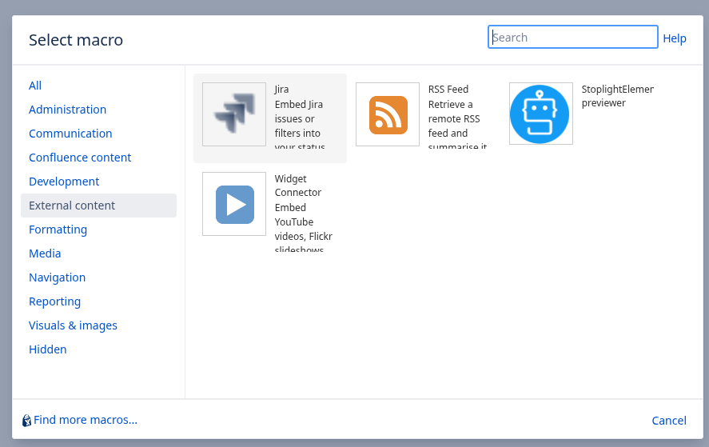
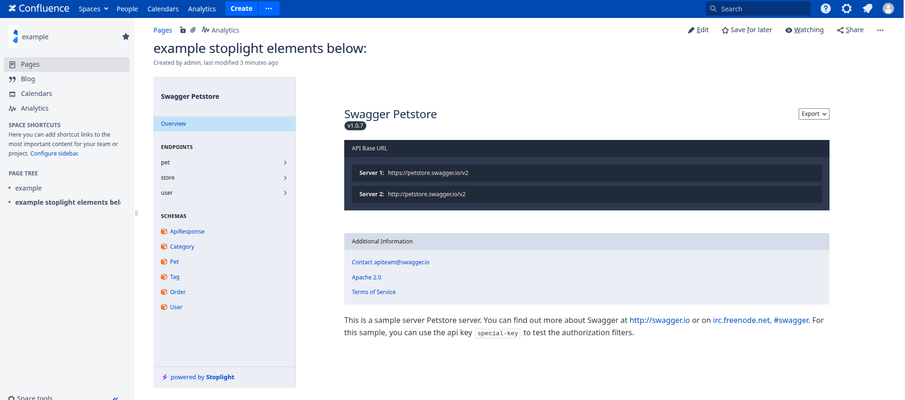

# Stoplight elements plugin for Confluence

## Introduction

---

This is an Atlassian Confluence plugin project which allows to integrate Stoplight Elements into Confluence page.  The project was created by Atlassian SDK, for further information see below. 

Further information about licensing you will find in LICENSE file.

## Compatibility

---

* All common browser
* All common systems
* Tested compatibility with Atlassian Confluence 7 and higher
   

## How to install or update

- Go to GitHub releases, download latest `jar` file
- Visit `Confluence administration` -> `Manage apps` -> `Upload app`. Select previous downloaded `jar`file
- Installed and ready to go!

## How to build and run

---

- `make install`
- Go to http://localhost:8090/ and complete setup:
  - Set `admin:admin` as admin credentials
  - Set `postgres` host, `confluence:qwerty` as database credentials
- `make upload`
